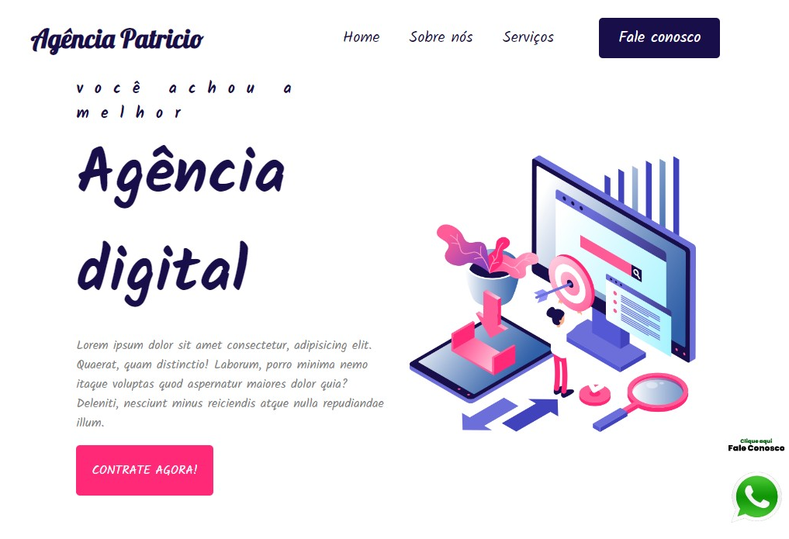

# Site Responsivo

Bem-vindo ao site responsivo! Este projeto foi desenvolvido com foco na criação de um site que se adapta a diferentes dispositivos e tamanhos de tela.

## Descrição do Projeto

Este projeto é um exemplo de site responsivo, o que significa que foi projetado e desenvolvido para garantir uma ótima experiência do usuário em qualquer dispositivo, seja um desktop, tablet ou smartphone. O layout e o conteúdo do site são ajustados dinamicamente para se adequar ao tamanho da tela, proporcionando uma navegação intuitiva e uma aparência visualmente agradável em todos os dispositivos.

## Funcionalidades

- Design responsivo que se adapta a diferentes tamanhos de tela.
- Utilização de técnicas modernas de HTML5 e CSS3 para criar layouts flexíveis e fluidos.
- Testado em uma variedade de dispositivos e navegadores para garantir compatibilidade e consistência.

## Tecnologias Utilizadas

- HTML5: Estruturação do conteúdo da página.
- CSS3: Estilização e layout responsivo.
- Media Queries: Utilizadas para aplicar estilos específicos com base no tamanho da tela.
- JavaScript (opcional): Adicionando interatividade e funcionalidades adicionais para dispositivos específicos.

## Como Utilizar

1. Acesse o site responsivo online clicando neste [link](https://seu-usuario.github.io/site-responsivo/).

2. Experimente redimensionar a janela do navegador em um desktop para ver o layout responsivo em ação.

3. Acesse o site em diferentes dispositivos, como tablets e smartphones, para verificar como ele se adapta automaticamente ao tamanho da tela.

4. Navegue pelo site para explorar seu conteúdo e funcionalidades em diferentes dispositivos.

## Captura de Tela
Esse print é parte da front page.

## Contribuições

Se você deseja contribuir para este projeto, siga estas etapas:

1. Faça um fork do repositório.
2. Crie sua própria branch: `git checkout -b feature/sua-feature`.
3. Faça suas alterações e commit: `git commit -am 'Adicione sua feature'`.
4. Faça push para a branch: `git push origin feature/sua-feature`.
5. Envie um pull request.

## Licença

Este projeto está licenciado sob a [Licença MIT](LICENSE).

---

**Nota:** Este projeto é apenas para fins educacionais e de demonstração.
